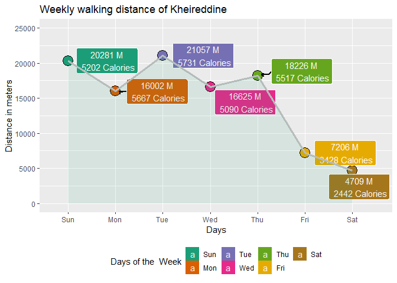
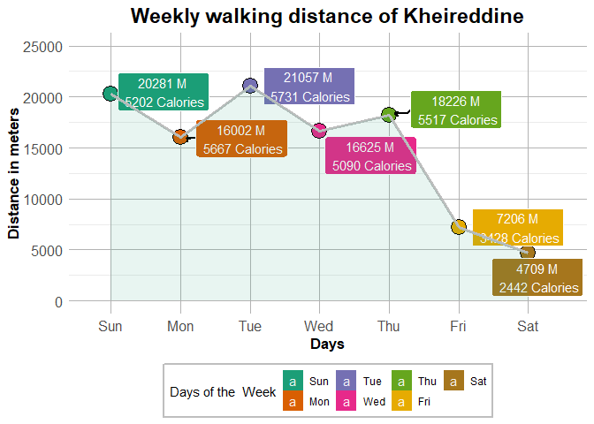
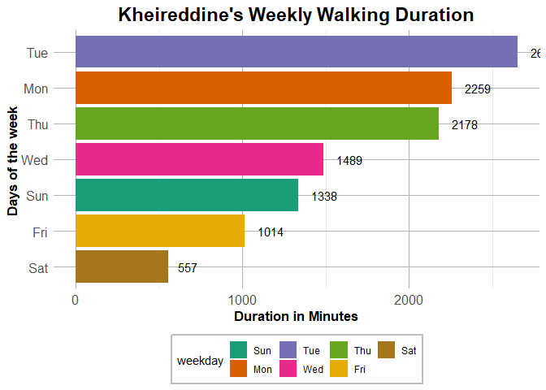
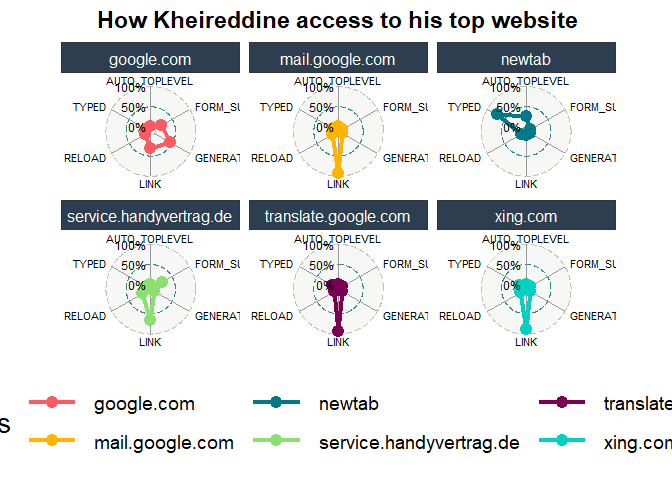
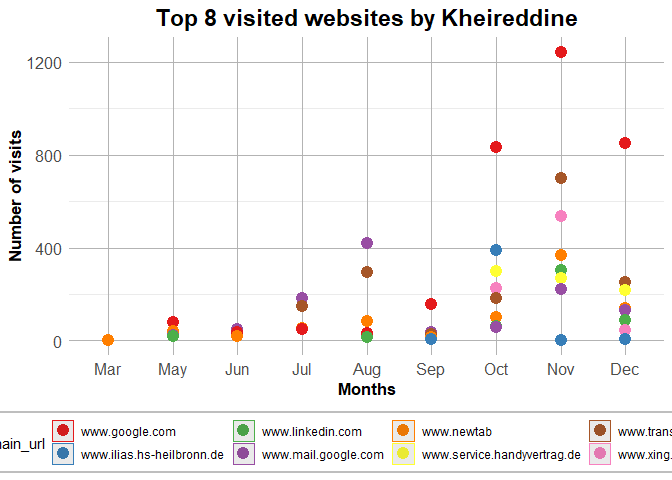

## Used Libraries

    # This line of code will install all the necessary packages required for the code to run properly and efficiently.

    # install.packages(c("abind", "forcats", "ggplot2", "ggradar", "ggrepel", "ggridges", "hrbrthemes", "lubridate", "plotly", "plyr", "purrr", "RColorBrewer", "readr", "scales", "stringr", "tibble", "tidyr", "tidyselect", "tidyverse", "viridis", "viridisLite"))

    library(abind) # is used for combining arrays along multiple dimensions.
    library(forcats) # is a package for working with categorical variables in R.
    library(ggplot2) # is a popular data visualization package for creating complex plots and graphics.
    library(ggradar) # is a package for creating radar charts.
    library(ggrepel)# is used for avoiding label overlapping in ggplot2.
    library(ggridges)# is used for creating ridgeline plots.
    library(hrbrthemes) # is a package that provides several themes for ggplot2.
    library(lubridate)# s used for working with dates and times in R.
    library(plotly) # is a package for creating interactive plots and graphics.
    library(plyr) # is a package for splitting, applying, and combining data.
    library(purrr) #  is a package for functional programming in R.
    library(RColorBrewer) #  is used for creating beautiful and distinct color palettes for maps and plots.
    library(readr) #  is used for reading and writing tabular data in R.
    library(scales) #  is used for working with scales and color palettes in ggplot2.
    library(stringr) # is used for working with strings in R.
    library(tibble) # is a package for creating tibbles, a modern re-imagining of data frames.
    library(tidyr) # is used for reshaping data in R.
    library(tidyselect) # is used for selecting columns of a data frame by name.
    library(tidyverse) # is a collection of packages, including ggplot2, dplyr, tidyr, readr, purrr, and tibble, that are designed to work together for data manipulation and visualization.
    # viridis and viridisLite are packages for creating color palettes that are friendly to 
    library(viridis)
    library(viridisLite)

    library(lubridate)

## Google Fit Data

### Discover Google Fit’s DATA

This data was collected over a one-week period by tracking my daily
health performance using the Google FIT application.

-   I used the glimpse() function to give the an overview of the data.
-   I used the names() function to display the names of the columns in
    the dataframe

<!-- -->

    Data_From_GoogleFit<- read.csv("./Daily activity metrics.csv") #Import the data of  my daily  health performance

    glimpse(Data_From_GoogleFit)  # Get an overview about the Data

    ## Rows: 13
    ## Columns: 15
    ## $ Date                  <chr> "2022-12-11", "2022-12-12", "2022-12-13", "2022-…
    ## $ Move.Minutes.count    <int> 119, 113, 163, 127, 185, 129, 90, 82, 140, 152, …
    ## $ Calories..kcal.       <dbl> 1858.8888, 2826.6267, 2819.2520, 2289.0340, 2714…
    ## $ Distance..m.          <dbl> 7811.39942, 7253.08062, 11272.82578, 6841.73175,…
    ## $ Heart.Points          <dbl> 38, 35, 66, 27, 48, 24, 15, 108, 41, 44, 54, 24,…
    ## $ Heart.Minutes         <int> 38, 33, 66, 27, 46, 24, 14, 59, 41, 44, 54, 23, …
    ## $ Average.speed..m.s.   <dbl> 0.8090631, 0.5528837, 0.6965961, 0.6882102, 0.53…
    ## $ Max.speed..m.s.       <dbl> 1.8685250, 2.4075410, 2.3322833, 1.7771778, 3.84…
    ## $ Min.speed..m.s.       <dbl> 0.2537886, 0.2621625, 0.2621625, 0.2621625, 0.24…
    ## $ Step.count            <int> 9741, 8840, 13397, 8408, 13291, 8715, 5701, 1036…
    ## $ Average.weight..kg.   <dbl> 110.1, NA, NA, NA, NA, NA, NA, NA, NA, NA, NA, N…
    ## $ Max.weight..kg.       <dbl> 110.1, NA, NA, NA, NA, NA, NA, NA, NA, NA, NA, N…
    ## $ Min.weight..kg.       <dbl> 110.1, NA, NA, NA, NA, NA, NA, NA, NA, NA, NA, N…
    ## $ Walking.duration..ms. <int> 7337881, 5865641, 7465398, 1677964, 5785905, 608…
    ## $ Running.duration..ms. <int> NA, 754521, NA, NA, 120418, NA, NA, 3629087, NA,…

    names(Data_From_GoogleFit) # Discover the Name of 'columns'

    ##  [1] "Date"                  "Move.Minutes.count"    "Calories..kcal."      
    ##  [4] "Distance..m."          "Heart.Points"          "Heart.Minutes"        
    ##  [7] "Average.speed..m.s."   "Max.speed..m.s."       "Min.speed..m.s."      
    ## [10] "Step.count"            "Average.weight..kg."   "Max.weight..kg."      
    ## [13] "Min.weight..kg."       "Walking.duration..ms." "Running.duration..ms."

### Transform the Google FIT’s DATA

-   This code uses the mutate() function to add a new column “weekday”
    to the dataframe and assigns the corresponding day of the week to
    each date in the “Date” column.

-   The code then uses the select() function to select specific columns
    “Distance..m.”, “weekday”, and “Calories..kcal.”.

-   It then uses the group\_by() function to group the data by the
    “weekday” column and finally, uses the summarize() function to
    summarize the data by summing the total calories and distance for
    each day of the week.

<!-- -->

    Data_From_GoogleFit_v1 <- Data_From_GoogleFit %>%
      mutate(weekday= wday(Date,label = TRUE))%>% # Get Weekday from the Date("DD-MM-YYYY") by uinsing the `wday() ` function
      select("Distance..m.",weekday,"Calories..kcal.") %>% # select the runned distance, Day of weeks
      group_by(weekday) %>%
      dplyr::summarize(across( .fns=sum)) #Sum the value of calories and distance of the same day like ` {"Sun":12,"Sat":11,"Sun" : 10}`->  `{"Sun":22,"Sat":11}`

    print(Data_From_GoogleFit_v1)

    ## # A tibble: 7 × 3
    ##   weekday Distance..m. Calories..kcal.
    ##   <ord>          <dbl>           <dbl>
    ## 1 Sun           20281.           5202.
    ## 2 Mon           16002.           5667.
    ## 3 Tue           21057.           5731.
    ## 4 Wed           16625.           5090.
    ## 5 Thu           18226.           5517.
    ## 6 Fri            7206.           3428.
    ## 7 Sat            4709.           2442.

### Create label for each data point

-   This function takes two arguments, “distance” and “calories”, and
    rounds them. It then combines the two values into a single string,
    with “M” and “Calories” appended to the distance and calorie values,
    respectively.

-   The function then returns this combined string as the “output”
    variable.

-   This output can be used as a label for a data point in a graph,
    displaying both the distance and calorie values for that point.

<!-- -->

    # This function  generates the text label for each data point, and returns  Distance and calorie
    Distance_label<-function(distance,calories){
      Distance<-round(distance,0)
      Distance<-paste(Distance,"M\n")

      Calories=round(calories,0)
      Calories<-paste(Calories,"Calories")

      output=paste(Distance,Calories)
      return (output)
    }

### General Theme

This theme will be implemented consistently across all graphs to prevent
duplicated code.

-   This code is creating a new graph object called “Themed\_Graph” with
    a minimal theme and additional modifications on its axis titles,
    axis text, plot title, legend background, panel grid and legend
    position.

-   I create these theme for consistent and visually pleasing appearance
    of the graphs by specifying the font size, font face, alignment, and
    other aesthetic elements for various components of the graph such as
    the axis titles, axis text, plot title, legend background, panel
    grid, and legend position. It makes the graph more readable, clear
    and easy to understand for the audience.

It also saves time by avoiding the need to manually adjust these
elements in each individual graph, and makes it easier to change the
appearance of all the graph in a project by modifying this code. It also
makes it easier to ensure compliance with a specific style guide or
branding guidelines.

    Global_theme <- function(Ggplot) {
      Themed_Graph=Ggplot+  theme_minimal()+ theme( axis.title.y  = element_text(hjust = 0.5,size = 13,face = "bold"),
                                  axis.title.x = element_text(hjust = 0.5,size = 13,face = "bold"),
                                  axis.text = element_text(size = 12),
                                  plot.title = element_text(hjust = 0.5, family = "Arial",face = "bold",size = 17),
                                  legend.background = element_rect(fill = "white",colour = "grey",size = 1),
                                  panel.grid.major = element_line(colour ="grey70" ,size = 0.1), legend.position = "bottom") 
      
      return(Themed_Graph)
    }

### Visualize 1 data of the Google Fit’s DATA

#### Before applying theme

I would like to demonstrate the appearance of the graphs prior to the
implementation of my theme.

-   As you can observe, the background does not match the foreground and
    this inconsistency can lead to visual discomfort for the viewer.

-   The title is not placed in a location that is easily visible to the
    viewer, and the gridlines are not prominently displayed.

-   In the following section(After Applying my theme), we will delve
    into the reasoning behind my selection of specific features to
    enhance the data visualization.

<!-- -->

    Data_From_GoogleFit_v1_Vis<- ggplot(Data_From_GoogleFit_v1,aes(weekday,Distance..m.,colors=weekday,group=1,label=Distance_label(Distance..m.,Calories..kcal.),fill=weekday))+
      geom_point(shape=21,   size=6) +
      ylim(0,25000)+
      geom_label_repel( color="white",point.padding = 0.50, nudge_x = .85, nudge_y = .15, segment.color="black", segment.size=1,      segment.angle=90, segment.curvature = -1e-20, arrow = arrow(length = unit(0.015, "npc")))+
      geom_line( color="grey",size=1.2) +
      geom_area(alpha=0.1)+
      scale_color_viridis(discrete = TRUE)+
      scale_fill_viridis(discrete = TRUE,option = "C") +
      guides(fill=guide_legend(title="Days of the  Week"))+
      theme(legend.position = "bottom")+
      scale_fill_brewer(palette = "Dark2")+
      labs(title = "Weekly walking distance of Kheireddine",x="Days",y="Distance in meters")

    Data_From_GoogleFit_v1_Vis

#### After applying my theme

I would like to exhibit the appearance of the graphs after the
implementation of my theme.

This R code creates a ggplot graph using the data in the
“Data\_From\_GoogleFit\_v1” data frame. I used the “weekday” variable
for the x-axis and the “Distance..m.” variable for the y-axis.

-   I used the “colors” aesthetic to color the points based on the
    “weekday” variable, I grouped the data in one group and added a
    label to the points using the “Distance\_label” function with the
    “Distance..m.” and “Calories..kcal.” variables. It also fills the
    area under the line graph with the “weekday” variable.

I did that, to effectively display the distance covered and the calories
expended, I have chosen to incorporate the calorie data in labels rather
than using separate curves. This is because the distance and calorie
values have distinct scales, which would make it difficult for the
viewer to discern both sets of information if they were presented as
separate curves.

-   I employed the use of the “geom\_point,” “geom\_label\_repel,”
    “geom\_line,” and “geom\_area” functions to create points with a
    specific shape and size, add labels that repel away from each other,
    connect the points with a line, and fill the area under the line,
    respectively.

This was done to guide the viewer’s focus on the progression of the
graph, as it can be challenging for the human memory to process data
without discernible patterns.

-   I utilized the “guides” function to add a title to the fill legend
    and the “theme” function to position the legend at the bottom of the
    graph. Additionally, I added a title to the graph and labeled the x
    and y axes.

This was done to ensure that the graph is easily readable and
interpretable, as the graph is relatively large in size. By positioning
the legend at the bottom, the width of the graph is aligned with the
height, reducing the need for the viewer to move their eyes horizontally
to read the legend.

    Global_theme(Data_From_GoogleFit_v1_Vis)

### Visualization 2 of the Google Fit’s DATA

-   This code takes the “Data\_From\_GoogleFit” dataframe and performs
    several operations on it to create a bar chart visualization of my
    weekly walking duration. The code first converts the
    “Walking.duration..ms.” column to minutes and groups the data by the
    “weekday” column. It then removes missing values and summarizes the
    data by summing the total walking duration for each day of the week.

-   Then I used the ggplot() function to create the bar chart, with the
    days of the week on the y-axis, the total walking duration in
    minutes on the x-axis, and the fill color of the bars representing
    the day of the week. The chart is then further customized using
    various theme and scale functions, such as theme\_bw() for a black
    and white theme, scale\_fill\_brewer() for a specific color palette,
    and geom\_text() for adding the walking duration labels on top of
    the bars.

-   The final benefit of the visualization is that it allows the viewer
    to quickly see and compare the total walking duration for each day
    of the week, helping to understand patterns or trends in my walking
    habits over time.

<!-- -->

    Walking_duration_Vis<-Data_From_GoogleFit %>%
      mutate(weekday= wday(Date,label = TRUE))%>%
      mutate(Walking.duration..ms.= round((Walking.duration..ms./100)/60))%>%
      select(weekday,Walking.duration..ms.) %>% # select the runned Walking duration and the  Day of weeks
      group_by(weekday) %>%
      remove_missing()%>%
      dplyr::summarize(across( .fns=sum))%>% #Sum the value of walking duration  depends on the days of week
      ggplot(aes(x=reorder(weekday,Walking.duration..ms.),y= Walking.duration..ms.,fill=weekday))+geom_col(stat="identity",position='dodge' ,) +coord_flip()+
      theme(legend.position = "bottom")+
      scale_fill_brewer(palette = "Dark2")+
      labs(title = "Kheireddine's Weekly Walking Duration",x="Days of the week ",y="Duration in Minutes")+  
      geom_text(aes(label = Walking.duration..ms. ),  colour = "black",  position = position_dodge(width = 1),hjust  = -0.5, size = 4)+  theme_bw()

    Global_theme(Walking_duration_Vis)

## Browser History Data

I obtained this data from my past research endeavors by utilizing the
Google Chrome browser.

***Note:*** When requesting data from Google, it returns the browsing
history data in JSON format. To facilitate further analysis, I converted
the data from JSON to CSV using an online editor.

### Discover the Data

I crafted this code to facilitate the efficient loading and examination
of the data contained within the “BrowserHistory.csv” file. It provides
a comprehensive overview of the data’s structure, including the names of
columns and unique values of a categorical field. This enables me to
gain a thorough understanding of the data and determine if further
processing or cleaning is required before utilizing it for analysis.
Additionally, it also assisted me in verifying the correctness of the
data format and the appropriate placement of columns.

    Data_from_GoogleBrowser_v1<- read.csv(file="./BrowserHistory.csv")
    glimpse(Data_from_GoogleBrowser_v1)  # Get an overview about the Data

    ## Rows: 16,441
    ## Columns: 6
    ## $ favicon_url     <chr> "https://www.google.com/favicon.ico", "https://www.goo…
    ## $ page_transition <chr> "LINK", "LINK", "LINK", "LINK", "LINK", "LINK", "LINK"…
    ## $ title           <chr> "Google Takeout", "Google Takeout", "Google Takeout", …
    ## $ url             <chr> "https://takeout.google.com/", "https://takeout.google…
    ## $ client_id       <chr> "pH0xws7eYIZV47Tomtihbg==", "pH0xws7eYIZV47Tomtihbg=="…
    ## $ time_usec       <dbl> 1.67179e+15, 1.67179e+15, 1.67179e+15, 1.67179e+15, 1.…

    names(Data_from_GoogleBrowser_v1) # Discover the Name of columns

    ## [1] "favicon_url"     "page_transition" "title"           "url"            
    ## [5] "client_id"       "time_usec"

    unique(Data_from_GoogleBrowser_v1$page_transition) # Discover  Categorical Field

    ## [1] "LINK"          "RELOAD"        "TYPED"         "AUTO_TOPLEVEL"
    ## [5] "GENERATED"     "FORM_SUBMIT"   "AUTO_BOOKMARK"

### Transform the data

-   **Step 1-&gt;** In the initial step of this code, I utilized the
    mutate() function in conjunction with the sapply() function to
    generate a new column, “Domain\_url,” within the data frame. The
    strsplit() function was employed to divide the values in the “url”
    column of the data frame based on the ‘/’ character. The \[ operator
    was then utilized to select the third element of the resulting split
    string, which corresponds to the domain of the URL.

-   **Step 2-&gt;** In the subsequent step of the code, I employed the
    mutate() function along with the if\_else() function to verify if
    the domain begins with “www.” or not. If not, the paste0() function
    is used to add “www.” to the domain.

-   **Step 3-&gt;** The third line of the code employs the select()
    function to preserve solely the “Domain\_url” and “page\_transition”
    columns in the data frame. The final line of code utilizes the
    group\_by() function to categorize the data based on the
    “Domain\_url” column.

<!-- -->

    Data_from_GoogleBrowser_v2<-Data_from_GoogleBrowser_v1 %>%
      mutate(Domain_url= sapply(strsplit(url,"/"), `[`, 3)) %>% # Step 1
      mutate(Domain_url= if_else((substr(Domain_url,1,4)!="www."),paste0("www.",Domain_url),Domain_url)) %>% # Step 2
      select(Domain_url,page_transition) %>% # Step3
      group_by(Domain_url)

    Data_from_GoogleBrowser_v2

    ## # A tibble: 16,441 × 2
    ## # Groups:   Domain_url [686]
    ##    Domain_url             page_transition
    ##    <chr>                  <chr>          
    ##  1 www.takeout.google.com LINK           
    ##  2 www.takeout.google.com LINK           
    ##  3 www.takeout.google.com LINK           
    ##  4 www.takeout.google.com LINK           
    ##  5 www.takeout.google.com LINK           
    ##  6 www.takeout.google.com LINK           
    ##  7 www.takeout.google.com LINK           
    ##  8 www.takeout.google.com LINK           
    ##  9 www.takeout.google.com LINK           
    ## 10 www.takeout.google.com LINK           
    ## # … with 16,431 more rows

### Rediscover the Data and Sumirezed it

In this segment of the code, I chose to re-examine the format of the
data to ensure its accuracy before proceeding to summarize it.

-   **Step 1-&gt;** In this step of the code, I employed the ddply()
    function from the plyr package to classify the data by the
    “Domain\_url” and “page\_transition” columns, and then tallied the
    number of rows for each group. This generated a summary of the data
    that includes the number of each type of transition for each domain,
    as illustrated in the example: {“Google”:{“Linked”:2,“Generated”:5
    ….}}

-   **Step 2-&gt;** In step 2 of the code, I utilized the select()
    function to retain only the “Domain\_url” and “V1” columns, and the
    group\_by() and summarize() functions to group the data by
    “Domain\_url” and calculate the total number of occurrences. This
    provided a summary of the number of visits for each domain.

-   **Step 3-&gt;** In step 3 of the code, I utilized the order()
    function to sort the data by the “V1” column in descending order.
    This means that the top visited domains will be at the top of the
    list, making it easier to identify the most frequently visited
    domains.

-   **Step 4-&gt;** In step 4, I employed the \[ \] operator to select
    the top 6 rows of the sorted data, this means the top 6 most
    frequently visited domains will be selected.

-   **Step 5-&gt;** In step 5 of the code, I utilized the t() function
    to transpose the matrix, which means reversing the rows and columns
    of the matrix.

<!-- -->

    Data_from_GoogleBrowser_v3<-ddply(Data_from_GoogleBrowser_v2,.(Domain_url,page_transition),nrow) # step 1
    glimpse(Data_from_GoogleBrowser_v3) # Show data 

    ## Rows: 1,002
    ## Columns: 3
    ## $ Domain_url      <chr> "www.", "www.11percent.de", "www.127.0.0.1:5500", "www…
    ## $ page_transition <chr> "LINK", "LINK", "AUTO_TOPLEVEL", "LINK", "LINK", "LINK…
    ## $ V1              <int> 3, 1, 2, 1, 2, 1, 3, 1, 1, 1, 9, 1, 1, 23, 8, 2, 5, 2,…

    Data_from_GoogleBrowser_v4<-Data_from_GoogleBrowser_v3 %>% # Step 2
      select(Domain_url,V1) %>% 
      group_by(Domain_url) %>%
      dplyr::summarize(across( .fns=sum))

    Top_visited_Websites=Data_from_GoogleBrowser_v4[order(Data_from_GoogleBrowser_v4$V1,decreasing = TRUE),] #Step 3
    Top_visited_Websites= Top_visited_Websites[0:6,1] # Step 4

    Top_visited_Websites

    ## # A tibble: 6 × 1
    ##   Domain_url                 
    ##   <chr>                      
    ## 1 www.google.com             
    ## 2 www.translate.google.com   
    ## 3 www.mail.google.com        
    ## 4 www.newtab                 
    ## 5 www.xing.com               
    ## 6 www.service.handyvertrag.de

    Top_visited_Websites=t(Top_visited_Websites) #Step 5
    Top_visited_Websites

    ##            [,1]             [,2]                       [,3]                 
    ## Domain_url "www.google.com" "www.translate.google.com" "www.mail.google.com"
    ##            [,4]         [,5]           [,6]                         
    ## Domain_url "www.newtab" "www.xing.com" "www.service.handyvertrag.de"

### Data selected for use in creating a Radar Chart

-   **Step 1-&gt;** In step 1, I used the order() function to sort the
    data by the “Page\_transition” field. This ensures that the data is
    in a specific order, which can make it easier to work with and
    interpret when creating a radar chart.

-   **Step 2-&gt;** Filters the data to include only rows where the
    “Domain\_url” field is in a pre-defined list of top visited
    websites.

-   **Step 3-&gt;** Replaces any NA values in the dataframe with 0. This
    will prevent any errors or issues caused by missing data when
    creating the radar chart

-   **Step 4-&gt;** Divides the values in each row by the sum of the
    row. This normalizes the data and ensures that the values are
    comparable across different rows

<!-- -->

      Data_from_GoogleBrowser_v3 =  Data_from_GoogleBrowser_v3[order(Data_from_GoogleBrowser_v3$page_transition,decreasing = TRUE),] # Step1
    View(Data_from_GoogleBrowser_v3)

      Radar_Chart_data_v1<- Data_from_GoogleBrowser_v3 %>% #Step 2
      filter( Domain_url %in%  Top_visited_Websites) %>%
      pivot_wider(names_from =page_transition,values_from = V1 )

    Radar_Chart_data_v1  

    ## # A tibble: 6 × 8
    ##   Domain_url                  TYPED RELOAD  LINK GENER…¹ FORM_…² AUTO_…³ AUTO_…⁴
    ##   <chr>                       <int>  <int> <int>   <int>   <int>   <int>   <int>
    ## 1 www.mail.google.com            25     56  1042      NA      NA      NA       2
    ## 2 www.newtab                    584     23    NA      NA      NA     219      NA
    ## 3 www.service.handyvertrag.de     1     96   513      NA     175      NA      NA
    ## 4 www.translate.google.com      118      3  1486      NA      NA      NA      NA
    ## 5 www.xing.com                   62     31   715      NA      NA      NA      NA
    ## 6 www.google.com                 NA    155  1029    1488     606       6      NA
    ## # … with abbreviated variable names ¹​GENERATED, ²​FORM_SUBMIT, ³​AUTO_TOPLEVEL,
    ## #   ⁴​AUTO_BOOKMARK

    Radar_Chart_data_v1[is.na(Radar_Chart_data_v1)]<-0  #Step 3

    Radar_Chart_data_v1

    ## # A tibble: 6 × 8
    ##   Domain_url                  TYPED RELOAD  LINK GENER…¹ FORM_…² AUTO_…³ AUTO_…⁴
    ##   <chr>                       <int>  <int> <int>   <int>   <int>   <int>   <int>
    ## 1 www.mail.google.com            25     56  1042       0       0       0       2
    ## 2 www.newtab                    584     23     0       0       0     219       0
    ## 3 www.service.handyvertrag.de     1     96   513       0     175       0       0
    ## 4 www.translate.google.com      118      3  1486       0       0       0       0
    ## 5 www.xing.com                   62     31   715       0       0       0       0
    ## 6 www.google.com                  0    155  1029    1488     606       6       0
    ## # … with abbreviated variable names ¹​GENERATED, ²​FORM_SUBMIT, ³​AUTO_TOPLEVEL,
    ## #   ⁴​AUTO_BOOKMARK

    Radar_Chart_data_v2<-Radar_Chart_data_v1 %>% #Step 4
      group_by(Domain_url) %>%
      dplyr::summarize(across(AUTO_TOPLEVEL:TYPED ,.fns =~./sum(across(AUTO_TOPLEVEL:TYPED))))
     

    Radar_Chart_data_v2

    ## # A tibble: 6 × 7
    ##   Domain_url                  AUTO_TOPLE…¹ FORM_…² GENER…³  LINK  RELOAD   TYPED
    ##   <chr>                              <dbl>   <dbl>   <dbl> <dbl>   <dbl>   <dbl>
    ## 1 www.google.com                   0.00183   0.185   0.453 0.313 0.0472  0      
    ## 2 www.mail.google.com              0         0       0     0.928 0.0499  0.0223 
    ## 3 www.newtab                       0.265     0       0     0     0.0278  0.707  
    ## 4 www.service.handyvertrag.de      0         0.223   0     0.654 0.122   0.00127
    ## 5 www.translate.google.com         0         0       0     0.925 0.00187 0.0734 
    ## 6 www.xing.com                     0         0       0     0.885 0.0384  0.0767 
    ## # … with abbreviated variable names ¹​AUTO_TOPLEVEL, ²​FORM_SUBMIT, ³​GENERATED

### Prepare the Data fo Visualization 1 for Radar Chart and visulize it:

This code uses the “Radar\_Chart\_data\_v2” dataframe to create a radar
chart visualization, allowing the viewer to focus on the top six
websites that the user accesses most frequently and the methods used to
access them. The use of a radar chart is particularly effective in this
scenario as it is well-suited for displaying categorical data, making it
easier to explore and understand the patterns and relationships within
the data.

-   ***Step 1-&gt;*** I used the mutate() function and str\_remove()
    function to remove the “www.” prefix from the “Domain\_url” field.

This is done to make the chart more readable and consistent.

-   ***Step 2-&gt;*** In the next step I used the ggradar() function to
    create a radar chart, with several specified options such as the
    font type, color, and grid label size. It also sets the extent of
    the X axis to be 1.2 times the default.

    -   **Font.radar** option specifies the font to be used for the
        radar chart, which is “Circular Air” in this case. This allows
        for a more visually appealing and easy to read chart.

    -   **Axis.line.colour** option specifies the color of the axis
        lines, which is “gray60” in this case. This allows to match the
        color of the chart with the color scheme of the report or
        presentation.

    -   **Legend.title** option specifies the title for the legend,
        which is “Websites” in this case. This makes it clear what the
        legend represents.

    -   **Legend.position** option specifies the position of the legend,
        which is “bottom” in this case. This allows to place the legend
        in a way that it does not overlap with the data points on the
        chart.

    -   **Grid.label.size** option specifies the size of the labels on
        the grid, which is 4 in this case. This allows for better
        readability of the chart.

    -   **Axis.label.size** option specifies the size of the labels on
        the axis, which is 3 in this case. This allows for better
        readability of the chart.

    -   **Group.point.size** option specifies the size of the points on
        the chart, which is 4 in this case. This allows to make the data
        points more visible on the chart.

    -   **Plot.extent.x.sf** option specifies the scaling factor for the
        x-axis, which is 1.2 in

Overall, using these parameters allows to create a radar chart that is
visually appealing, easy to read, and better suited for displaying
categorical data.

-   **Step 3-&gt;** I used the theme() function to customize various
    elements of the chart such as the strip text and background color,
    legend position, and plot title font.

    -   **The strip.text** option specifies the font size, color and
        margin of the strip text. This allows for better readability of
        the chart.  

    -   **The strip.background** option specifies the background color
        of the strip, which is “\#2C3E50” in this case. This allows to
        match the color of the chart with the color scheme of the report
        or presentation.  

    -   **The legend.position** option specifies the position of the
        legend, which is “bottom” in this case. This allows to place the
        legend in a way that it does not overlap with the data points on
        the chart.  
         

    -   **The plot.title** option specifies the font family,face, size
        and horizontal justification of the plot title. This allows to
        make the title more visually appealing and easy to read.

     

-   **Step 4-&gt;** I utilized the facet\_wrap() function to create
    multiple panels of the chart, organizing the data by domain url and
    arranging them in a 3x2 grid.

This allows for an easy comparison of the data across multiple websites,
and makes the visualization more organized and readable for the viewer.

    Radar_Chart_data_v2 %>%
      mutate(Domain_url=str_remove(Domain_url,"www.")) %>% #Step1
      ggradar(font.radar = "Circular Air",axis.line.colour = "gray60",legend.title = "Websites",legend.position = "bottom",grid.label.size = 4,axis.label.size=3,group.point.size=4,plot.extent.x.sf=1.2)+ # Step 2
      
      
      theme(strip.text = element_text(size = 12,colour = "white",margin= margin(t= 5, b=5)), # Step 3
      strip.background = element_rect(fill = "#2C3E50"),
      legend.position = "bottom",
      plot.title =element_text(hjust = 0.5, family = "Arial",face = "bold",size = 17))+
      labs(title = "How Kheireddine access to his top website")+
      facet_wrap(~Domain_url,ncol=3 )# Step 4

### Data visualzation 2 of the Browsing History

I utilized browsing history data to identify the top visited websites by
analyzing the number of visits per month, using the month as a
categorical variable and the number of visits as a continuous value.

#### Data Mapping

***Step 1-&gt;*** The first mutate() function uses the sapply() and
strsplit() functions to extract the domain url from the url field, and
assigns the result to a new field called “Domain\_url”.

***Step 2-&gt;*** The second mutate() function uses the if\_else()
function to check if the domain url starts with “www.” and if not, it
adds “www.” before the domain url.

***Step 3-&gt;*** The third mutate() function uses the as.POSIXct() and
as.numeric() functions to convert the “time\_usec” field to a POSIXct
date-time format, and assigns the result to a new field called
“newdate”.

***Step 4-&gt;*** The fourth mutate() function uses the as.Date()
function to convert the “newdate” field to a date format, and assigns
the result to a new field called “newdate2”.

***Step 5-&gt;*** The fifth mutate() function uses the month() function
to extract the month from the “newdate2” field, and assigns the result
to a new field called “Month”.

***Step 6-&gt;*** The select() function is used to select the columns of
the dataframe and keep the desired columns.

    Data_from_GoogleBrowser_v5<-Data_from_GoogleBrowser_v1 %>%
      mutate(Domain_url= sapply(strsplit(url,"/"), `[`, 3)) %>%  # Step 1
      mutate(Domain_url= if_else((substr(Domain_url,1,4)!="www."),paste0("www.",Domain_url),Domain_url)) %>% # Step 2
      mutate(newdate= as.POSIXct(as.numeric(as.character(time_usec/1000000)), origin="1970-01-01", tz="GMT") ) %>% # Step 3
      mutate(newdate2= as.Date(newdate,format = "%m/%d/%y")) %>% # Step 4
      mutate(Month= month(newdate2,label = TRUE)) %>% # Step 5
      select(newdate2,newdate,Domain_url,Month,time_usec)  # Step 6

#### Data Mapping

***Step 1-&gt;*** The select() function is used to select the columns of
the dataframe and keep only the columns “Domain\_url” and “Month”.

***Step 2-&gt;*** The mutate() function is used to add a new column “V1”
with the value 1 to the dataframe.

***Step 3-&gt;*** The group\_by() function is used to group the data by
the “Domain\_url” and “Month” columns.

***Step 4-&gt;*** The dplyr::summarise\_each() function is used to apply
the sum function on all columns of the dataframe.

***Step 5-&gt;*** The dataframe is ordered by the “V1” column in
decreasing order.

***Step6 -&gt;*** The dataframe is sliced to get the top 10 values of
the ‘Domain\_url’ column and stored in a new dataframe
‘Data\_from\_GoogleBrowser\_Top\_websites’.

      Data_from_GoogleBrowser_v6<-Data_from_GoogleBrowser_v5 %>%
      select(Domain_url,Month) %>% # Step 1
      mutate(V1=1) %>% # Step 2
      group_by(Domain_url,Month) %>% # Step 3
      dplyr::summarise_each( funs(sum)) # Step 4

    View(Data_from_GoogleBrowser_v6)

    Data_from_GoogleBrowser_v6=Data_from_GoogleBrowser_v6[order(Data_from_GoogleBrowser_v6$V1,decreasing = TRUE),] # Step 5

    Data_from_GoogleBrowser_Top_websites=Data_from_GoogleBrowser_v6[0:10 ,1] # Step 6

#### Visualize the Data

***Step 1-&gt;*** The filter() function is used to filter the dataframe
to include only rows where the “Domain\_url” field is in the pre-defined
list of top visited websites( Data\_from\_GoogleBrowser\_Top\_websites).
\# step 6 from the previous code.

***Step2 -&gt;*** I used the ggplot() function to initiate the graph,
with the “Month” column as the x-axis, the “V1” column as the y-axis,
and the “Domain\_url” column as the color.

-   **geom\_area(alpha=0.1)** A value of 0.1 means that the area will be
    mostly transparent, allowing the viewer to see the distribution of
    the data points and how they change over time, while still being
    able to see the individual data points.

-   **geom\_point(size=4)** allows the viewer to clearly identify the
    individual data points in the graph, which can be particularly
    useful when trying to identify patterns or trends within the data.
    By increasing the size of the points, it makes them more noticeable
    and easier to see, especially when the graph contains a large number
    of data points. It also makes the data points more prominent, which
    can help to draw the viewer’s attention to them, making it easier to
    understand the data

-   **Theme\_ipsum()** allows to apply a pre-defined theme to the graph,
    which can improve its overall appearance and make it easier for the
    reader to read and interpret the data. Additionally, this function
    can help to make the graph more professional looking, which can be
    important when presenting the data to others.

-   **The scale\_color\_brewer()** function is used to apply a color
    palette to the graph. And it allows the reader to easily
    differentiate between the different websites represented in the
    graph. The “Set1” palette is a pre-defined color scheme that
    contains a variety of distinct colors, which will be used to color
    the points in the scatter plot. This allows the reader to quickly
    and easily identify patterns and trends within the data, which can
    be particularly useful when comparing data across multiple websites.

<!-- -->

    Graph<-Data_from_GoogleBrowser_v6 %>%
      filter(Domain_url %in%  t(Data_from_GoogleBrowser_Top_websites) ) %>% # Step1
      ggplot( aes(x=Month, y=V1,color=Domain_url)) +
      geom_point(size=4) +
      theme_ipsum()+  scale_colour_brewer(palette = "Set1")+
      geom_area(alpha=0.1)+
      theme(legend.position = "bottom")+

      labs(title = "Top 8 visited websites by Kheireddine",x="Months",y="Number of visits")

    Global_theme(Graph)

## Session Information

    sessionInfo()

    ## R version 4.2.2 (2022-10-31 ucrt)
    ## Platform: x86_64-w64-mingw32/x64 (64-bit)
    ## Running under: Windows 10 x64 (build 19044)
    ## 
    ## Matrix products: default
    ## 
    ## locale:
    ## [1] LC_COLLATE=English_United Kingdom.utf8 
    ## [2] LC_CTYPE=English_United Kingdom.utf8   
    ## [3] LC_MONETARY=English_United Kingdom.utf8
    ## [4] LC_NUMERIC=C                           
    ## [5] LC_TIME=English_United Kingdom.utf8    
    ## 
    ## attached base packages:
    ## [1] stats     graphics  grDevices utils     datasets  methods   base     
    ## 
    ## other attached packages:
    ##  [1] viridis_0.6.2      viridisLite_0.4.1  dplyr_1.0.10       tidyverse_1.3.2   
    ##  [5] tidyselect_1.2.0   tidyr_1.2.1        tibble_3.1.8       stringr_1.4.1     
    ##  [9] scales_1.2.1       readr_2.1.3        RColorBrewer_1.1-3 purrr_0.3.5       
    ## [13] plyr_1.8.8         plotly_4.10.1      lubridate_1.8.0    hrbrthemes_0.8.0  
    ## [17] ggridges_0.5.4     ggrepel_0.9.2      ggradar_0.2        ggplot2_3.4.0     
    ## [21] forcats_0.5.2      abind_1.4-7       
    ## 
    ## loaded via a namespace (and not attached):
    ##  [1] httr_1.4.4          jsonlite_1.8.2      modelr_0.1.10      
    ##  [4] assertthat_0.2.1    highr_0.10          googlesheets4_1.0.1
    ##  [7] cellranger_1.1.0    yaml_2.3.6          gdtools_0.2.4      
    ## [10] Rttf2pt1_1.3.11     pillar_1.8.1        backports_1.4.1    
    ## [13] glue_1.6.2          extrafontdb_1.0     digest_0.6.31      
    ## [16] rvest_1.0.3         colorspace_2.0-3    htmltools_0.5.4    
    ## [19] pkgconfig_2.0.3     broom_1.0.2         haven_2.5.1        
    ## [22] tzdb_0.3.0          googledrive_2.0.0   farver_2.1.1       
    ## [25] generics_0.1.3      ellipsis_0.3.2      withr_2.5.0        
    ## [28] lazyeval_0.2.2      cli_3.4.1           magrittr_2.0.3     
    ## [31] crayon_1.5.2        readxl_1.4.1        evaluate_0.19      
    ## [34] fs_1.5.2            fansi_1.0.3         xml2_1.3.3         
    ## [37] tools_4.2.2         data.table_1.14.2   hms_1.1.2          
    ## [40] gargle_1.2.1        lifecycle_1.0.3     munsell_0.5.0      
    ## [43] reprex_2.0.2        compiler_4.2.2      systemfonts_1.0.4  
    ## [46] rlang_1.0.6         grid_4.2.2          rstudioapi_0.14    
    ## [49] htmlwidgets_1.6.0   labeling_0.4.2      rmarkdown_2.19     
    ## [52] gtable_0.3.1        DBI_1.1.3           R6_2.5.1           
    ## [55] gridExtra_2.3       knitr_1.41          fastmap_1.1.0      
    ## [58] extrafont_0.18      utf8_1.2.2          stringi_1.7.8      
    ## [61] Rcpp_1.0.9          vctrs_0.5.1         dbplyr_2.2.1       
    ## [64] xfun_0.36
